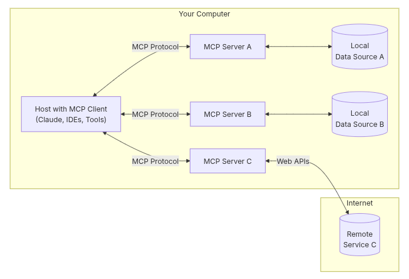
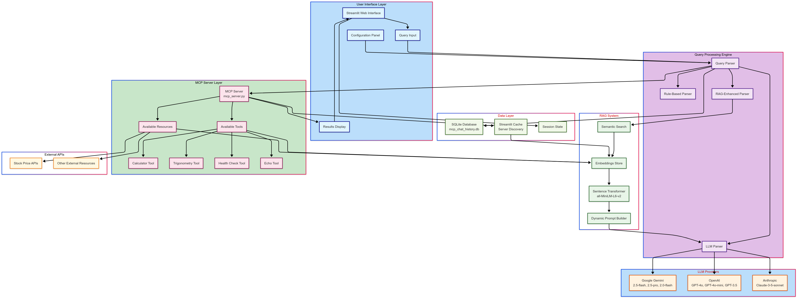
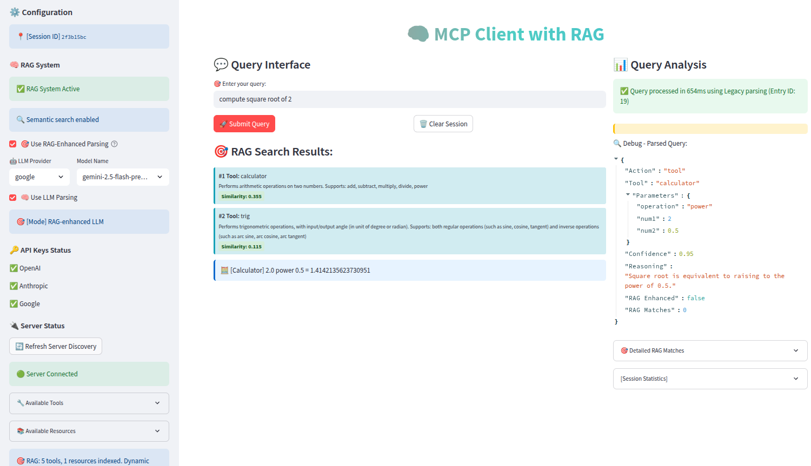

# RAG MCP

The RAG system is particularly well-designed, using sentence transformers to build rich contextual embeddings and performing semantic search to find the most relevant tools for each query. This makes the system much more robust than traditional keyword-based approaches.

## What is [MCP](https://modelcontextprotocol.io/introduction)

A protocol to provide context to LLM models




## Architecture Diagram 

MCP with RAG




The Mermaid diagram illustrates:

- **7 Distinct Layers** with color coding for easy understanding
- **Complete Data Flow** from user input through RAG processing to tool execution
- **Decision Tree Logic** showing how queries are routed through different parsing modes
- **RAG Integration** highlighting how semantic search enhances tool selection
- **Multi-LLM Support** showing integration with Google, OpenAI, and Anthropic
- **MCP Server Integration** with tool discovery and execution
- **Data Persistence** including SQLite storage and caching mechanisms

## Key Features



1. **Intelligent Tool Selection** using RAG to find relevant tools dynamically
2. **Flexible Parsing Strategy** with fallback mechanisms (RAG → LLM → Rule-based)
3. **Comprehensive Logging** for debugging and performance analysis
4. **Caching Strategy** for efficient server discovery
5. **Multi-Provider LLM Support** for flexibility and redundancy

## Setup
```bash
# create a virtual environment
conda create -n mcp
conda activate mcp

# obtain source code
git clone https://github.com/digital-duck/st_rag_mcp.git
cd st_rag_mcp
pip install -r requirements.txt

# open 1st terminal
cd src
python mcp_server.py

# in 2nd terminal
conda activate mcp
cd src
streamlit run mcp_client.py
```

## Demo Video
- [MCP + RAG](https://youtu.be/)


## References

- [RAG-MCP: Mitigating Prompt Bloat in LLM Tool Selection via Retrieval-Augmented Generation](https://arxiv.org/abs/2505.03275)
- [ALITA: GENERALIST AGENT ENABLING SCALABLE AGENTIC REASONING WITH MINIMAL PREDEFINITION AND MAXIMAL SELF-EVOLUTION](https://arxiv.org/abs/2505.20286)
- [MCP - RAG & Self-Evolve Agent](https://youtu.be/ZtwN79n9dRE?si=5GYFUrX7INMxhUNM)


